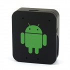

MediaTek Based GSM Tracker
==========================

This project is a collection of documentation and tools from research into a Chinese GSM device.

The goal was to find an inexpensive off the shelf minature GSM unit that could be repurposed for other projects. Typical GSM development kits are relatively large and expensive in comparison.

##Specifications

Feature      | Specification
------------ | -------------
Picture      | 
Network      | GSM
Band         | 850/900/1800/1900Mhz
Power Supply | USB 5V
Battery Type | 3.7V 400mAh LIPO
Dimensions   | 1.93 in x 1.46 in x 0.75 in (4.9 cm x 3.7 cm x 1.9 cm)
Functions    | GSM Tracker, SOS calls, remote listening device
Processor    | MediaTek MT6250. GSM/GPRS/EDGE-RX Class 12, Quad band, ARM7-EJ 260MHz, 64Mb pseudo-SRAM.
Purchase     | http://dx.com/p/mini-multi-functional-gsm-personal-position-tracker-for-child-elder-black-250295

##Contents

* [Device Teardown](docs/teardown.md)
* Serial connection
* Reading firmware
* AT commands
