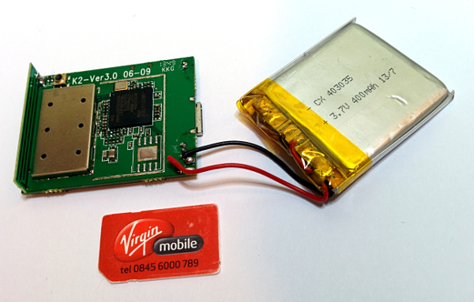
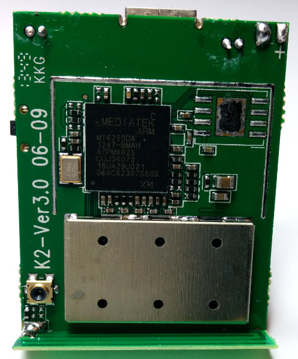
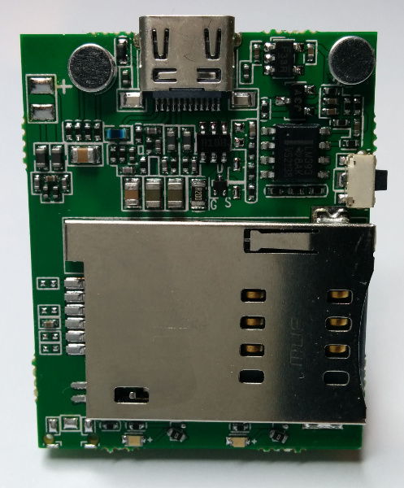

Device Teardown
==========================

##Overview

The device comes with an attached 3.7V LIPO, but you can also power it from the 5V USB charge cable.

[View full size: Overview](images/device01.jpg?raw=true)

##Front

On the front you can see the main ARM SoC. At the bottom is the internal strip antenna and just above on the left is an external antenna socket.

[View full size: Front](images/device03.jpg?raw=true)

##Back

The back of the device has the SIM slot which also acts as the power button. When you insert a SIM card the device powers up. Also notice the 2 microphones, possibly one is used for the sound activation (calls you when ambient sound passes a certain threshold). On the right side is the push button to activate the SOS call.

Finally notice the 12 pin 'USB' connector popular with Chinese phones. The pitch is very fine and adapters are hard to come by, making it a pain to connect to. The USB charge cable only has connections for power.

[View full size: Back](images/device02.jpg?raw=true)
